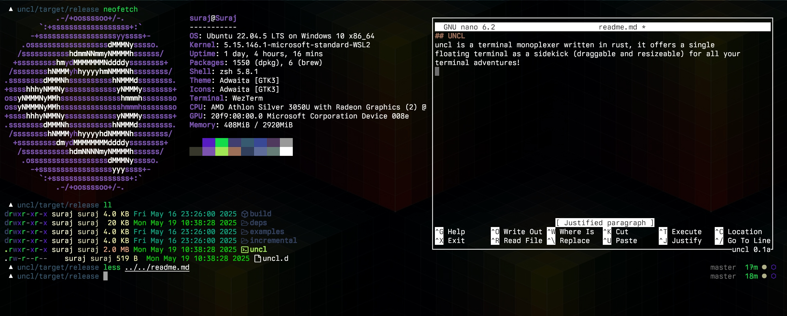

# uncl 
uncl is a terminal monoplexer - a single, toggleable, resizeable, and draggable floating term window as an accomplice to your worst terminal misdeeds, written in rust

  
   

> [!WARNING]
> Early alpha release, expect glitches and bugs.
